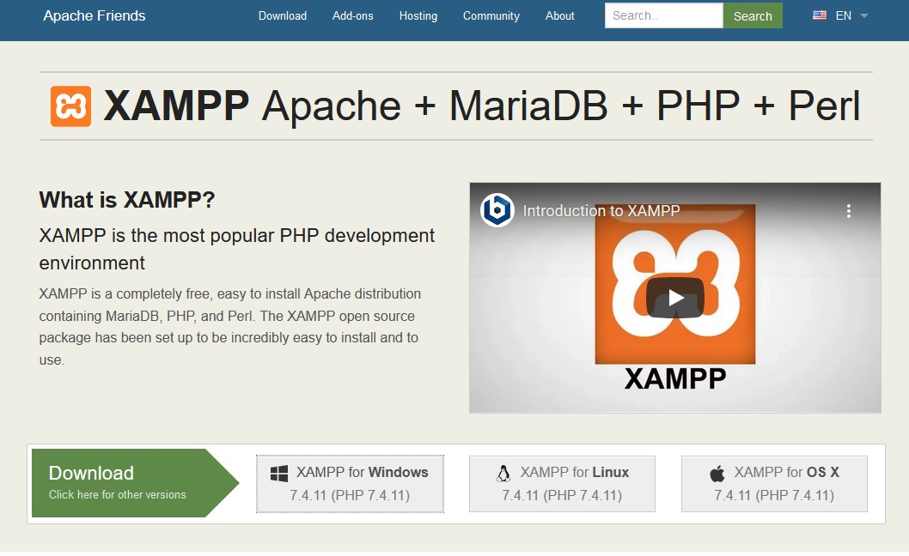
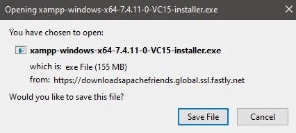
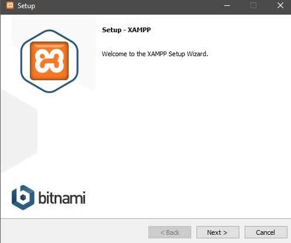
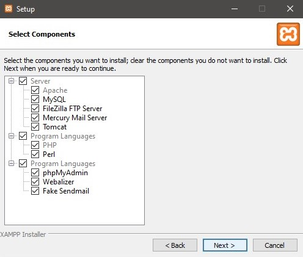
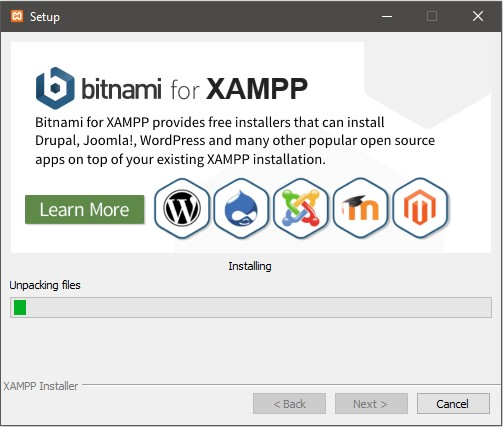
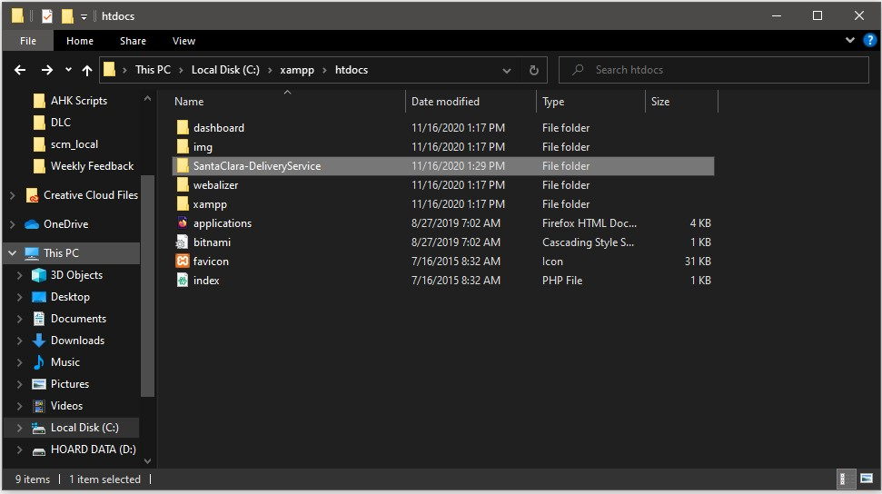
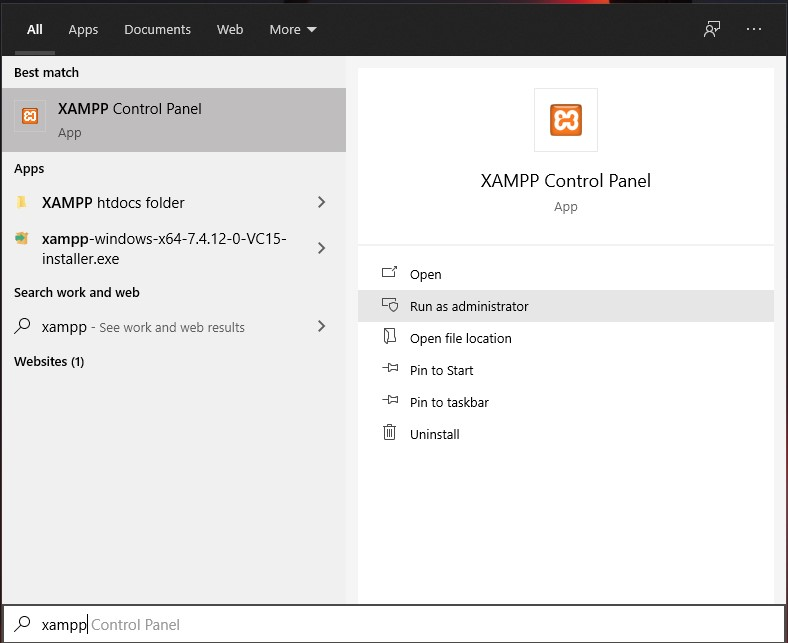
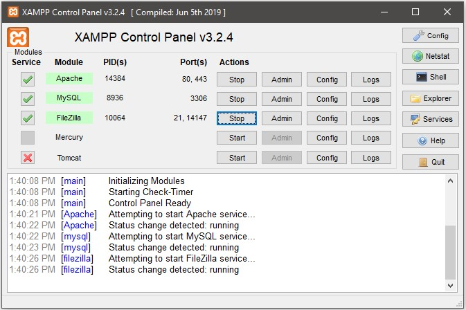
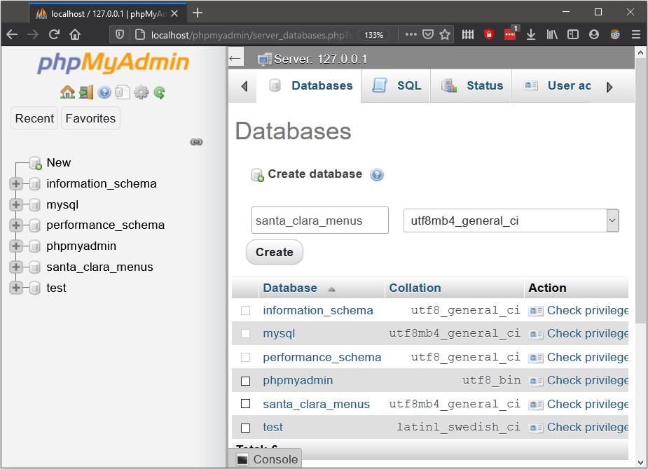
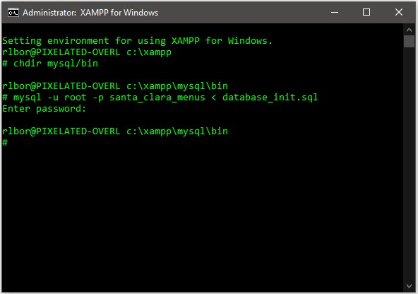

# Santa Clara-DeliveryService
An on-demand food delivery service serving Santa Clara County, developed by (group members &amp; profile links here).


## Installation Tutorial

This is a guide to install the files, software, and applications needed to run our On-Demand Food Delivery Software.
It will require the items below prior installation of the SCM Software:
1. Computer running windows 10, MacOS, or Linux
2. Source code folder (given)
3. Chrome (reccomended), Firefox, or Safari with access to localhost


## 1. Download XAMPP

To run the database of SCM, download XAMPP at [apchefriends.org](https://www.apachefriends.org/index.html).
Scroll down an locate the "Download" Button along with the options of the three major operating systems. **All three operating systems have similar installation process, this tutorial will follow a Windows 10 installation.**



- Select "XAMPP for windows" and an installer window will pop up.




- Click "Save File" and find the installer.exe file in download path.


- When executing the installation path, be sure to "Run as Administrator". This will give the installer access to certain privileges on your Windows machine.


- Follow "Setup" window by hitting the "Next >" Button.




- Leave the default selected components to be installed and hit "Next >"




- Choose the file path for placing the installation folder. **It is recommended** to install it within the  computer's local disk (C:\\) to have XAMPP function as intended.


- The installation loading will then begin and install XAMPP onto your terminal.




- Once finally installed, move the software file into XAMPP directory into the "htdoc" folder. The file path may look like this: `C:\xampp\htdocs`




- Lastly, move the `database_init.sql` file into `\xampp\mysql\bin` file path.


## 2. Running XAMPP

After the installation of XAMPP, we will go through on running the application.

- First, open the control panel of XAMPP with administration privileges (or Unix equivalent).




- The XAMPP control panel will open and provide module options (shown below). Toggle the check boxes for Apache and MySQL and also click on their Start buttton.




- Click on Apache Module's Admin button and will redirect you to PHPMyAdmin localhost server. Under Databases, create a new database "santa_clara_menus" with the default collation, as shown below.




- Back on the Control Panel, activate the shell command to the list of buttons onto the right of the window. Console shell will appear. Change the directory into `\xampp\mysql\bin` and enter the code below:

```
mysql -u root -p santa_clara_menus < database_init.sql
```


It may ask for a password, but hit enter regardless. The shell command will look like this:



