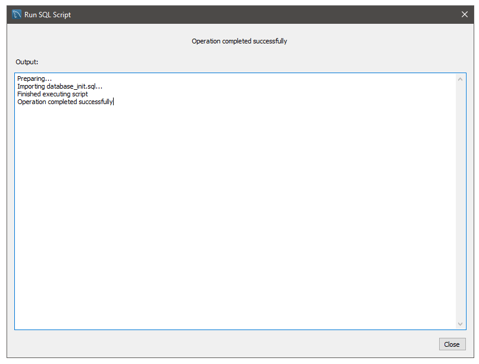

# SCM Installation Guide
This is the installation guide to run the software in a Windows 10 computer. MacOS and Linux OS distros installation may differ, but this guide may help as a reference.

The installation video is also provided with the link https://youtu.be/Br16qAKE0iE.

**Requirements:**
- Windows 10 Machine
- Chrome or Firefox (with security settings and add-ons disabled)
- `SantaClara-DeliveryService` source code folder

**Reference items:**
- XAMPP download link -- https://www.apachefriends.org/index.html
- MySQL Workbench CE download link -- https://dev.mysql.com/downloads/
- `database_init.sql` -- located in `...\SantaClara-DeliveryService\OTHERS`
- `conn.php` -- located in `...\SantaClara-DeliveryService\includes`

### Download External Applications
---
XAMPP and MySQL CE Workbench are the only two external applications needed to run the software. You can find their download links under "Reference items"

#### XAMPP

 1. Download XAMPP installation package onto your computer
 2. Follow the installation guide, keeping all options default, however make sure to have XAMPP file directory inside the `C:\` drive
 4. Finish and download

  

#### MySQL Workbench

1. Go to the given link for MySQL Workbench.
2. Under all of the options click and select *MySQL Community Server*.
3. In the next page, click and select *Go to Download Page >* to find the MySQL Installer MSI.
4. click and select *Download* with under Windows (x86, 32-bit) MSI Installer, version 8.0.22, and 405.2M size.
5. Download the installation package, and selecting the *Developer* option under the Installer.

  

## Preparing the Software
---
This will show how to prepare the source code to make the software compatible with the two external software. Follow instructions in the given order.

#### XAMPP
1. Open `conn.php` and `database_init.sql`; set aside for the time being
2. Place `SantaClara-DeliveryService` the specified file path: `C:\xampp\htdocs`
3. Close the file path
4. Open the "XAMPP Control Panel" application with administrative priviledges
5. Toggle the two red X's under the "MySQL" and "Apache" module
6. Start the "MySQL" and "Apache" module by hitting their respective *Start* button.

  

7. Under the "MySQL" module click and select "admin", which will open *phpMyAdmin* into the default web-browser
8. In *phpMyAdmin* click and select "User accounts"
9. Select the "add user account" option.
10. Copy user information from `conn.php` onto the "login information" field
11. toggle both items in the "Database for user account"
12. Select "Check all" toggle in the *Global priviledges* section
13. Execute the new user privileges' by clicking *Go* in the bottom left of the page

  

14. Close the *phpMyAdmin* webpage, while leaving the *XAMPP Control Panel* open

#### MySQL Workbench CE
15. Open MySQL Workbench application
16. Select and click the plus "(+)" icon next to "MySQL Connections"

17. Fill the information needed with the same username written in `conn.php`. You may name the Connection to your liking.

18. Check the "port" ID in `conn.php`, *XAMPP Control Panel* (under mySQL module), and on the "Setup New Connection" window

20. Select *OK* and enter the same password from `conn.php`
21. Click on the newly created MySQL Connection under the name given and enter credentials. A connection warning may appear, but click "Continue Anyway"
22. A new tab should open in *MySQL Workbench*; select the path `file > Run SQL Script..` and selecting the `database_init.sql` file

23. Hit "Run" and a output window should appear.

## Opening the Software
After all the steps are completed, the software is now ready to be executed.

1. Open "Firefox" or "Chrome"
2. Enter `http://localhost/SantaClara-DeliveryService/` into the url bar and enter
3. Software is now running for use

 
